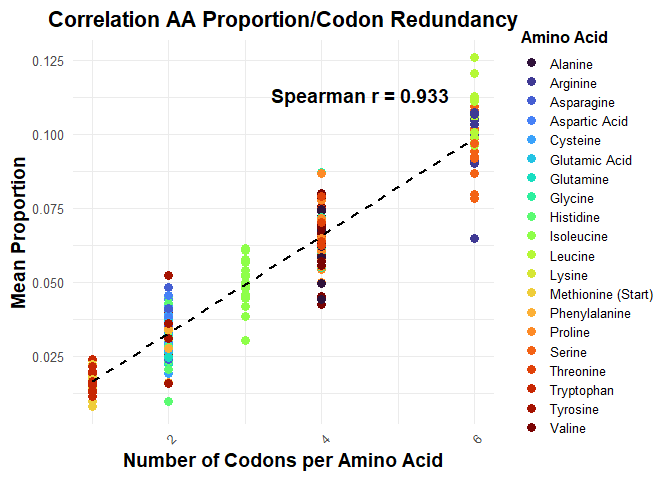
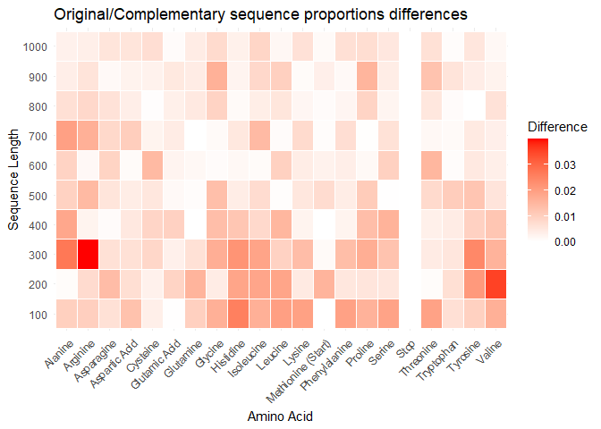
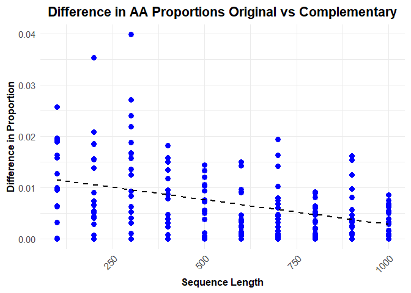
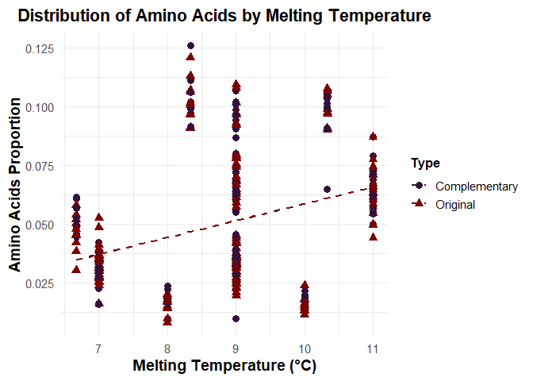

Backdown
================
2025-02-04

Remarks : use Biostrings or seqinr packages to lighten code

``` r
library(tidyverse)
library(forcats)  # fct_reorder
library(tibble)
library(data.table)
```

``` r
source("functions.R")
source("extradata.R")
source("functionsVisualisation.R")
```

# Nucleotides Sequence creation

## Sequence itself

``` r
genRnaSeq(n = 40, complementary = TRUE)
```

    ## $Original
    ## [1] "GACCAAUCCAUCUUUGUAUCCCCGGACUGCCGAUGUUCUU"
    ## 
    ## $Complementary
    ## [1] "CUGGUUAGGUAGAAACAUAGGGGCCUGACGGCUACAAGAA"

## Data creation and curation

Here’s a glimpse of the data we have for each length

    ## # A tibble: 10 × 6
    ## # Groups:   Length [10]
    ##    Length AminoAcid  Type  TotalCount Proportion MeanTm
    ##     <dbl> <chr>      <chr>      <dbl>      <dbl>  <dbl>
    ##  1    100 Threonine  Orig…         23     0.0740    9  
    ##  2    200 Glutamine  Comp…         24     0.0377    9  
    ##  3    300 Phenylala… Orig…         24     0.0251    7  
    ##  4    400 Valine     Orig…         86     0.0680    9  
    ##  5    500 Arginine   Orig…        145     0.0906   10.3
    ##  6    600 Aspartic … Comp…         67     0.0354    9  
    ##  7    700 Serine     Orig…        240     0.108     9  
    ##  8    800 Serine     Comp…        250     0.0985    9  
    ##  9    900 Serine     Comp…        286     0.101     9  
    ## 10   1000 Glutamic … Comp…        102     0.0322    9

# Visualisation

## Amino Acid Proportion Distribution

<!-- -->

#### Hypothesis 1 : It appears that there is a clear correlation between the number of codons encoding each amino acid and their observed proportions. To confirm this, we assess the monotonic positive relationship between these two variables using a Spearman correlation index.

<!-- -->

We display a heatmap of absolute differences in the original and
complementary strands frequencies
<!-- -->

#### Hypothesis 2 : The ‘random’ distribution of AA tends to be very close between the original and complementary strand as the size of the strand and the number of repetitions increases

<!-- -->

### Amino Acid Melting Temperature Distribution

<!-- -->

#### Hypothesis 3 : The data suggests a positive correlation between melting temperature and amino acid proportion. However, no definitive conclusion can be drawn, as the melting temperature calculation process is highly questionable and requires further scrutiny.
