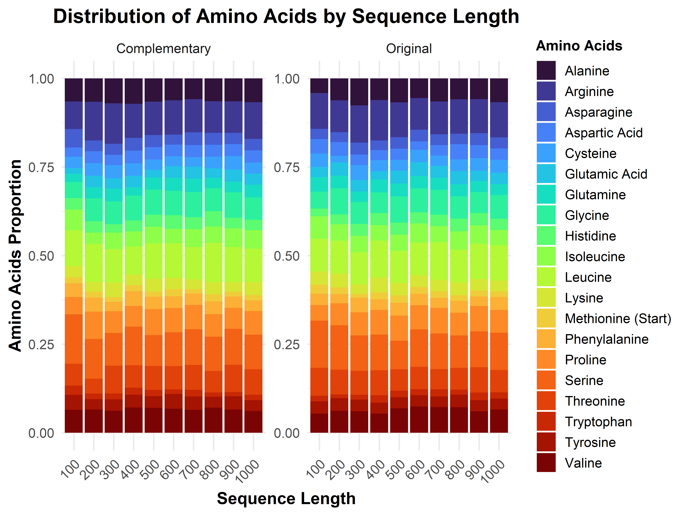
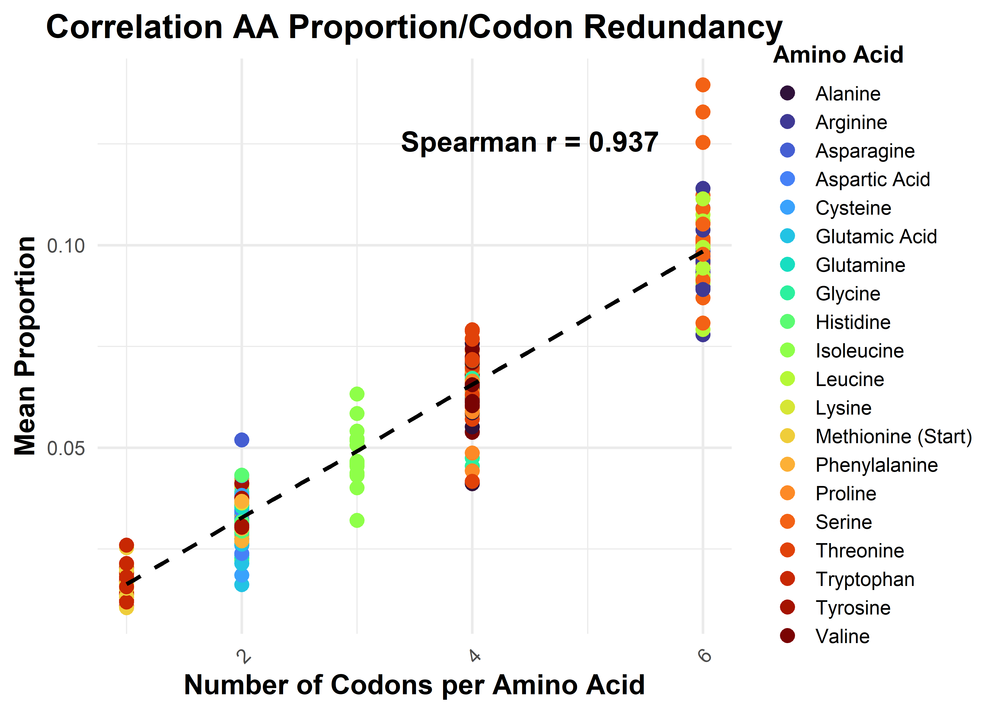

Backdown
================
2025-02-04

Remarks : use Biostrings or seqinr packages to lighten code

``` r
library(tidyverse)
library(forcats)  # fct_reorder
library(tibble)
library(data.table)
```

``` r
source("functions.R")
source("extradata.R")
source("functionsVisualisation.R")
```

# Nucleotides Sequence creation

## Sequence itself

``` r
genRnaSeq(n = 40, complementary = TRUE)
```

    ## $Original
    ## [1] "AGUGACCUCAUUAAAUGCCGUGAUAGUGGUUCCAUAUCAG"
    ## 
    ## $Complementary
    ## [1] "UCACUGGAGUAAUUUACGGCACUAUCACCAAGGUAUAGUC"

## Data creation and curation

Here’s a glimpse of the data we have for each length

    ## # A tibble: 10 × 6
    ## # Groups:   Length [10]
    ##    Length AminoAcid  Type  TotalCount Proportion MeanTm
    ##     <dbl> <chr>      <chr>      <dbl>      <dbl>  <dbl>
    ##  1    100 Cysteine   Comp…         10     0.0325   9   
    ##  2    200 Valine     Orig…         40     0.0619   9   
    ##  3    300 Leucine    Comp…         91     0.0943   8.33
    ##  4    400 Methionin… Orig…         25     0.0195   8   
    ##  5    500 Proline    Comp…        117     0.0738  11   
    ##  6    600 Proline    Orig…        131     0.0682  11   
    ##  7    700 Glutamic … Orig…         74     0.0335   9   
    ##  8    800 Valine     Orig…        184     0.0721   9   
    ##  9    900 Proline    Comp…        168     0.0589  11   
    ## 10   1000 Serine     Orig…        332     0.105    9

# Visualisation

## Amino Acid Proportion Distribution

<!-- -->

#### Hypothesis 1 : It appears that there is a clear correlation between the number of codons encoding each amino acid and their observed proportions. To confirm this, we assess the monotonic positive relationship between these two variables using a Spearman correlation index.

<!-- -->

We display a heatmap of absolute differences in the original and
complementary strands frequencies
<!-- -->

#### Hypothesis 2 : The ‘random’ distribution of AA tends to be very close between the original and complementary strand as the size of the strand and the number of repetitions increases

<!-- -->

### Amino Acid Melting Temperature Distribution

<!-- -->

#### Hypothesis 3 : The data suggests a positive correlation between melting temperature and amino acid proportion. However, no definitive conclusion can be drawn, as the melting temperature calculation process is highly questionable and requires further scrutiny.
