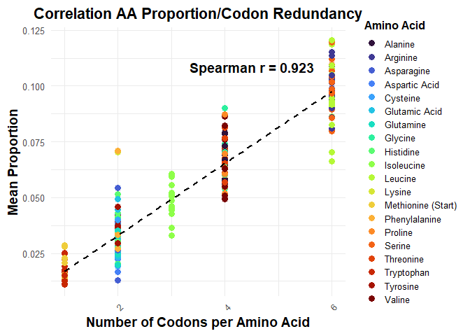
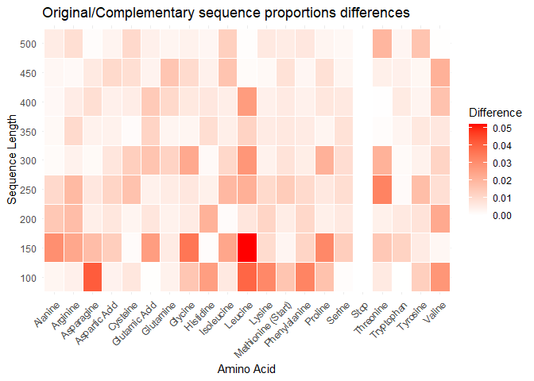
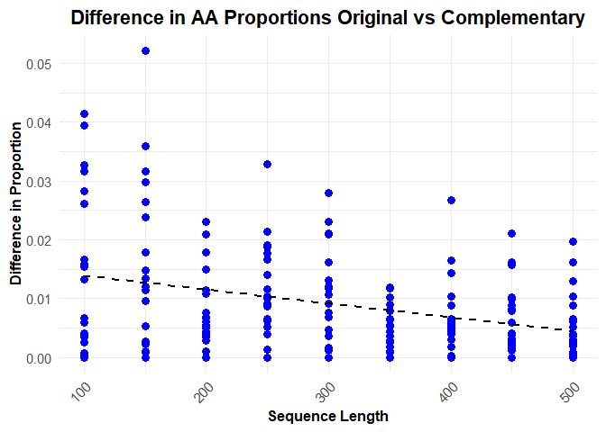

Backdown
================
2025-02-04

Remarks : use Biostrings or seqinr packages to lighten code

``` r
library(tidyverse)
library(forcats)  # fct_reorder
library(tibble)
library(data.table)
```

``` r
source("R/functions.R")
source("R/extradata.R")
source("R/functionsVisualisation.R")
```

# Nucleotides Sequence creation

## Sequence itself

``` r
S <- genRnaSeq(n = 40, complementary = TRUE)
```

#### Codons splitting and shift

    ## Shift = 1:

    ## List of 2
    ##  $ Original     : chr [1:13] "CCC" "UUA" "CCA" "UUA" ...
    ##  $ Complementary: chr [1:13] "GGG" "AAU" "GGU" "AAU" ...

    ## 
    ## Shift = 2:

    ## List of 2
    ##  $ Original     : chr [1:13] "CCU" "UAC" "CAU" "UAC" ...
    ##  $ Complementary: chr [1:13] "GGA" "AUG" "GUA" "AUG" ...

    ## 
    ## Shift = 3:

    ## List of 2
    ##  $ Original     : chr [1:12] "CUU" "ACC" "AUU" "ACU" ...
    ##  $ Complementary: chr [1:12] "GAA" "UGG" "UAA" "UGA" ...

## Data creation and curation

Here’s a glimpse of the data we have for each length

    ## # A tibble: 9 × 6
    ## # Groups:   Length [9]
    ##   Length AminoAcid   Type  TotalCount Proportion MeanTm
    ##    <dbl> <chr>       <chr>      <dbl>      <dbl>  <dbl>
    ## 1    100 Cysteine    Comp…          6     0.0192   9   
    ## 2    150 Valine      Comp…         30     0.0642   9   
    ## 3    200 Tryptophan  Orig…         12     0.0191  10   
    ## 4    250 Leucine     Orig…         68     0.0864   8.33
    ## 5    300 Isoleucine  Comp…         57     0.0593   6.67
    ## 6    350 Lysine      Orig…         41     0.0371   7   
    ## 7    400 Arginine    Orig…        124     0.0983  10.3 
    ## 8    450 Tyrosine    Comp…         57     0.0397   7   
    ## 9    500 Aspartic A… Orig…         48     0.0303   9

# Visualisation

## Amino Acid Proportion Distribution

<!-- -->

#### Hypothesis 1 : It appears that there is a clear correlation between the number of codons encoding each amino acid and their observed proportions. To confirm this, we assess the monotonic positive relationship between these two variables using a Spearman correlation index.

<!-- -->

We display a heatmap of absolute differences in the original and
complementary strands frequencies
<!-- -->

#### Hypothesis 2 : The ‘random’ distribution of AA tends to be very close between the original and complementary strand as the size of the strand and the number of repetitions increases

<!-- -->

### Amino Acid Melting Temperature Distribution

<!-- -->

#### Hypothesis 3 : The data suggests a positive correlation between melting temperature and amino acid proportion. However, no definitive conclusion can be drawn, as the melting temperature calculation process is highly questionable and requires further scrutiny.
