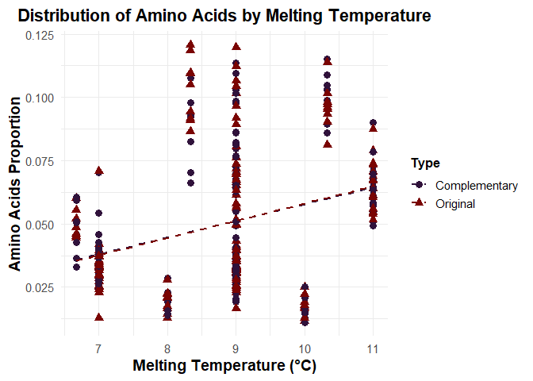

Backdown
================
2025-02-04

Remarks : use Biostrings or seqinr packages to lighten code

``` r
library(tidyverse)
library(forcats)  # fct_reorder
library(tibble)
library(data.table)
```

``` r
source("R/functions.R")
source("R/extradata.R")
source("R/functionsVisualisation.R")
```

# Nucleotides Sequence creation

## Sequence itself

``` r
S <- genRnaSeq(n = 40, complementary = TRUE)
```

#### Codons splitting and shift

``` r
cat("Shift = 1:\n")
```

    ## Shift = 1:

``` r
print(splitIntoCodons(S, shift = 1))
```

    ## $Original
    ##  [1] "AUU" "GGU" "CAA" "GAG" "GGU" "CGA" "UAC" "UGC"
    ##  [9] "CGG" "GGU" "UGC" "AGC" "AUC"
    ## 
    ## $Complementary
    ##  [1] "UAA" "CCA" "GUU" "CUC" "CCA" "GCU" "AUG" "ACG"
    ##  [9] "GCC" "CCA" "ACG" "UCG" "UAG"

``` r
cat("\nShift = 2:\n")
```

    ## 
    ## Shift = 2:

``` r
print(splitIntoCodons(S, shift = 2))
```

    ## $Original
    ##  [1] "UUG" "GUC" "AAG" "AGG" "GUC" "GAU" "ACU" "GCC"
    ##  [9] "GGG" "GUU" "GCA" "GCA" "UCA"
    ## 
    ## $Complementary
    ##  [1] "AAC" "CAG" "UUC" "UCC" "CAG" "CUA" "UGA" "CGG"
    ##  [9] "CCC" "CAA" "CGU" "CGU" "AGU"

``` r
cat("\nShift = 3:\n")
```

    ## 
    ## Shift = 3:

``` r
print(splitIntoCodons(S, shift = 3))
```

    ## $Original
    ##  [1] "UGG" "UCA" "AGA" "GGG" "UCG" "AUA" "CUG" "CCG"
    ##  [9] "GGG" "UUG" "CAG" "CAU"
    ## 
    ## $Complementary
    ##  [1] "ACC" "AGU" "UCU" "CCC" "AGC" "UAU" "GAC" "GGC"
    ##  [9] "CCC" "AAC" "GUC" "GUA"

## Data creation and curation

Here’s a glimpse of the data we have for each length

    ## # A tibble: 9 × 6
    ## # Groups:   Length [9]
    ##   Length AminoAcid   Type  TotalCount Proportion MeanTm
    ##    <dbl> <chr>       <chr>      <dbl>      <dbl>  <dbl>
    ## 1    100 Alanine     Orig…         23     0.0735  11   
    ## 2    150 Serine      Orig…         53     0.113    9   
    ## 3    200 Methionine… Comp…         13     0.0211   8   
    ## 4    250 Lysine      Orig…         20     0.0253   7   
    ## 5    300 Aspartic A… Orig…         26     0.0275   9   
    ## 6    350 Threonine   Comp…         73     0.0662   9   
    ## 7    400 Isoleucine  Orig…         73     0.0573   6.67
    ## 8    450 Alanine     Comp…         95     0.0662  11   
    ## 9    500 Threonine   Orig…         98     0.0625   9

# Visualisation

## Amino Acid Proportion Distribution

<!-- -->

#### Hypothesis 1 : It appears that there is a clear correlation between the number of codons encoding each amino acid and their observed proportions. To confirm this, we assess the monotonic positive relationship between these two variables using a Spearman correlation index.

<!-- -->

We display a heatmap of absolute differences in the original and
complementary strands frequencies
<!-- -->

#### Hypothesis 2 : The ‘random’ distribution of AA tends to be very close between the original and complementary strand as the size of the strand and the number of repetitions increases

<!-- -->

### Amino Acid Melting Temperature Distribution

<!-- -->

#### Hypothesis 3 : The data suggests a positive correlation between melting temperature and amino acid proportion. However, no definitive conclusion can be drawn, as the melting temperature calculation process is highly questionable and requires further scrutiny.
