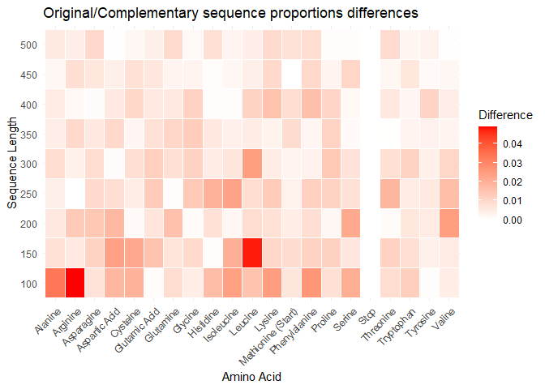
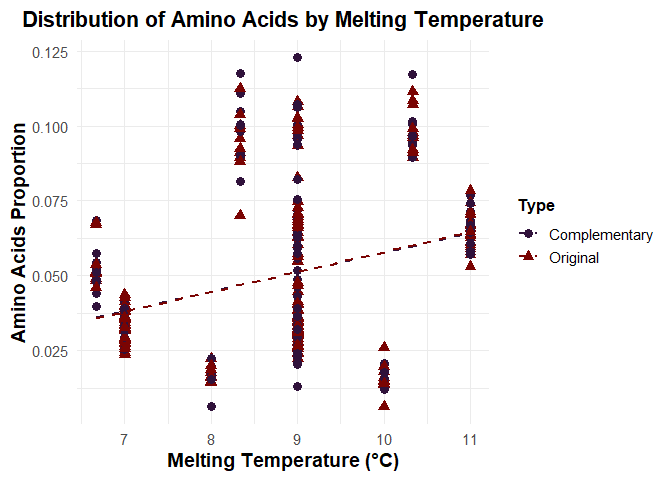

Backdown
================
2025-02-04

Remarks : use Biostrings or seqinr packages to lighten code

``` r
library(tidyverse)
library(forcats)  # fct_reorder
library(tibble)
library(data.table)
```

``` r
source("R/functions.R")
source("R/extradata.R")
source("R/functionsVisualisation.R")
```

# Nucleotides Sequence creation

## Sequence itself

``` r
genRnaSeq(n = 40, complementary = TRUE)
```

    ## $Original
    ## [1] "CUGCACGUUACGCGACAUGGUACUGCCAGUCCGGUCCGAA"
    ## 
    ## $Complementary
    ## [1] "GACGUGCAAUGCGCUGUACCAUGACGGUCAGGCCAGGCUU"

## Data creation and curation

Here’s a glimpse of the data we have for each length

    ## # A tibble: 10 × 6
    ## # Groups:   Length [10]
    ##    Length AminoAcid  Type  TotalCount Proportion MeanTm
    ##     <dbl> <chr>      <chr>      <dbl>      <dbl>  <dbl>
    ##  1    100 Valine     Orig…         15     0.0478    9  
    ##  2    200 Proline    Orig…         38     0.0613   11  
    ##  3    300 Tryptophan Orig…         25     0.0260   10  
    ##  4    400 Tryptophan Comp…         23     0.0182   10  
    ##  5    500 Valine     Comp…        103     0.0651    9  
    ##  6    600 Proline    Comp…        123     0.0653   11  
    ##  7    700 Tyrosine   Comp…         86     0.0388    7  
    ##  8    800 Arginine   Orig…        231     0.0911   10.3
    ##  9    900 Glycine    Comp…        181     0.0633   11  
    ## 10   1000 Threonine  Comp…        200     0.0629    9

# Visualisation

## Amino Acid Proportion Distribution

<!-- -->

#### Hypothesis 1 : It appears that there is a clear correlation between the number of codons encoding each amino acid and their observed proportions. To confirm this, we assess the monotonic positive relationship between these two variables using a Spearman correlation index.

<!-- -->

We display a heatmap of absolute differences in the original and
complementary strands frequencies
<!-- -->

#### Hypothesis 2 : The ‘random’ distribution of AA tends to be very close between the original and complementary strand as the size of the strand and the number of repetitions increases

<!-- -->

### Amino Acid Melting Temperature Distribution

<!-- -->

#### Hypothesis 3 : The data suggests a positive correlation between melting temperature and amino acid proportion. However, no definitive conclusion can be drawn, as the melting temperature calculation process is highly questionable and requires further scrutiny.
