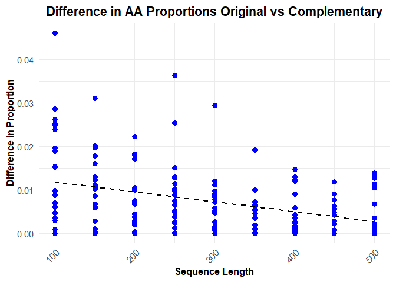

Backdown
================
2025-02-04

Remarks : use Biostrings or seqinr packages to lighten code

``` r
library(tidyverse)
library(forcats)  # fct_reorder
library(tibble)
library(data.table)
```

``` r
source("R/functions.R")
source("R/extradata.R")
source("R/functionsVisualisation.R")
```

# Nucleotides Sequence creation

## Sequence itself

``` r
genRnaSeq(n = 40, complementary = TRUE)
```

    ## $Original
    ## [1] "AAUCGAUGAUCAUCUAAACACCGUGCAUACCUUUGUCGUA"
    ## 
    ## $Complementary
    ## [1] "UUAGCUACUAGUAGAUUUGUGGCACGUAUGGAAACAGCAU"

## Data creation and curation

Here’s a glimpse of the data we have for each length

    ## # A tibble: 9 × 6
    ## # Groups:   Length [9]
    ##   Length AminoAcid  Type   TotalCount Proportion MeanTm
    ##    <dbl> <chr>      <chr>       <dbl>      <dbl>  <dbl>
    ## 1    100 Serine     Origi…         21     0.0662   9   
    ## 2    150 Lysine     Origi…         16     0.0340   7   
    ## 3    200 Serine     Compl…         62     0.0986   9   
    ## 4    250 Leucine    Compl…         74     0.0941   8.33
    ## 5    300 Cysteine   Compl…         32     0.0333   9   
    ## 6    350 Valine     Origi…         72     0.0653   9   
    ## 7    400 Isoleucine Origi…         70     0.0556   6.67
    ## 8    450 Leucine    Origi…        143     0.0999   8.33
    ## 9    500 Asparagine Compl…         56     0.0357   7

# Visualisation

## Amino Acid Proportion Distribution

<!-- -->

#### Hypothesis 1 : It appears that there is a clear correlation between the number of codons encoding each amino acid and their observed proportions. To confirm this, we assess the monotonic positive relationship between these two variables using a Spearman correlation index.

<!-- -->

We display a heatmap of absolute differences in the original and
complementary strands frequencies
<!-- -->

#### Hypothesis 2 : The ‘random’ distribution of AA tends to be very close between the original and complementary strand as the size of the strand and the number of repetitions increases

<!-- -->

### Amino Acid Melting Temperature Distribution

<!-- -->

#### Hypothesis 3 : The data suggests a positive correlation between melting temperature and amino acid proportion. However, no definitive conclusion can be drawn, as the melting temperature calculation process is highly questionable and requires further scrutiny.
